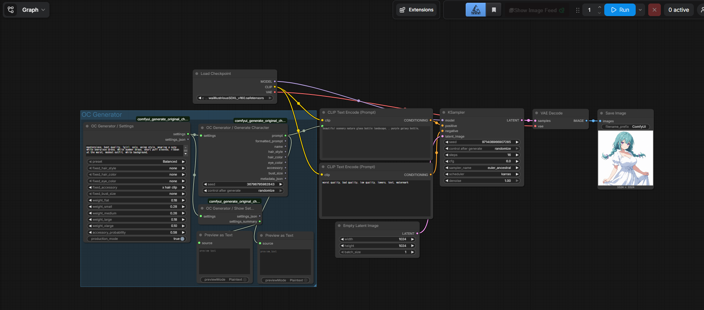
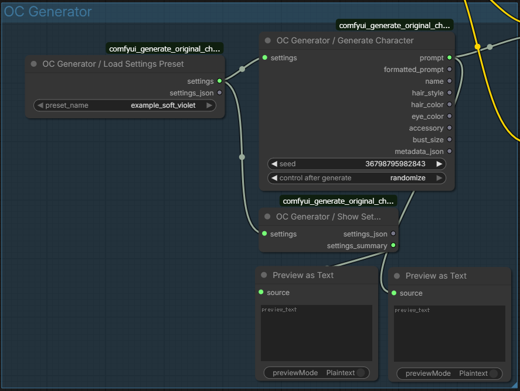
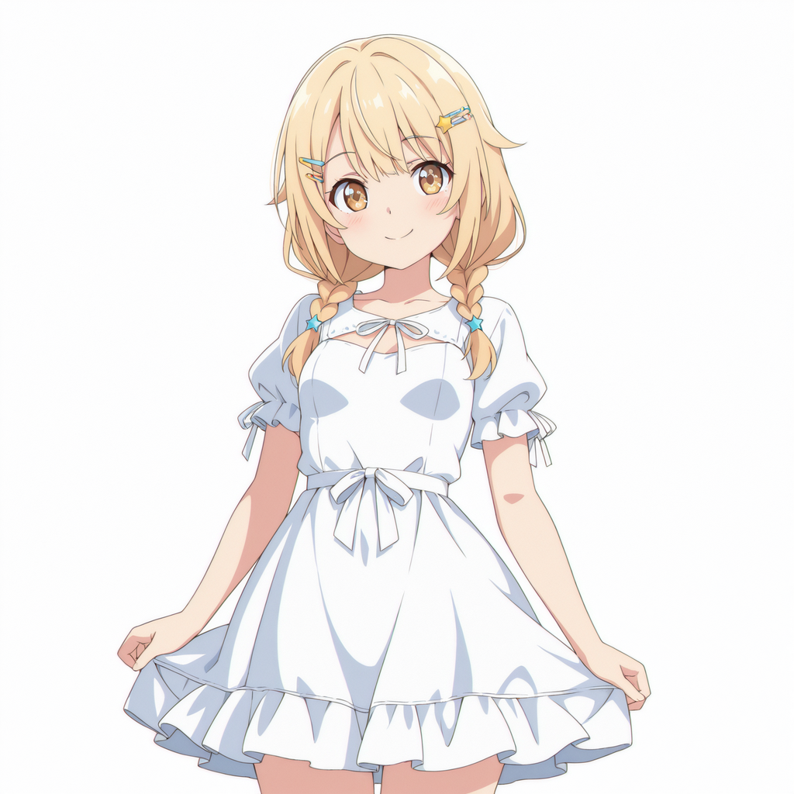

# comfyui-original-character-generator


오리지널 캐릭터 프롬프트 생성과 재사용 가능한 설정 관리를 위한 ComfyUI 커스텀 노드입니다.

**Languages:** [English](README.md) | [日本語](README_ja.md) | [한국어](README_ko.md) | [简体中文](README_zh-CN.md)

## 스크린샷

### 워크플로 개요



### 저장된 Settings Preset



## 샘플 출력

<p align="center">
  
  
  
</p>
<p align="center">
  
  
  
</p>

### 워크플로 렌더 샘플

<p align="center">
  
  
  
</p>
<p align="center">
  
  
</p>

더 많은 예시는 [`examples/`](examples) 에 있습니다.

## 먼저 웹 버전으로 사용해 보기

브라우저에서 먼저 시험해 보고 싶다면 아래 웹 버전을 사용할 수 있습니다.

- [original-character-generator-web](https://nade-eaf4fc.github.io/original-character-generator-web/)

웹 앱은 이 ComfyUI 노드 세트와 호환되는 `settings_json` 파일을 내보낼 수 있습니다.

## 기존 사용자 안내

최근 업데이트로 인해 기존 워크플로가 바로 동작하지 않거나, 노드를 다시 연결해야 할 수 있습니다.

불편을 드려 죄송합니다. 초기에 clone 해서 사용해 주신 분들께 감사드립니다.

## 기능

- 재사용 가능한 settings 객체로 오리지널 캐릭터 프롬프트 생성
- 헤어스타일, 머리색, 눈색, 액세서리, 가슴 크기 고정 가능
- 가슴 크기 가중치와 액세서리 등장 확률 조정 가능
- `user_presets` 에서 `settings_json` 저장 및 불러오기 가능
- 전용 `Show Settings` 노드로 설정 내용 확인 가능
- 샘플 워크플로와 샘플 preset 데이터 포함

## 설치

### 방법 1: 폴더를 직접 복사

1. 이 저장소 폴더를 `ComfyUI/custom_nodes/` 안에 넣습니다.
2. ComfyUI 를 재시작합니다.
3. 노드 메뉴에서 `OC Generator` 를 검색합니다.

### 방법 2: git clone

```bash
cd ComfyUI/custom_nodes
git clone https://github.com/nade-eaf4fc/comfyui-original-character-generator.git
```

clone 후 ComfyUI 를 재시작하세요.

## 포함된 노드

현재 노드 구성은 다음과 같습니다.

- `OC Generator / Settings`
- `OC Generator / Show Settings`
- `OC Generator / Save Settings JSON`
- `OC Generator / Load Settings Preset`
- `OC Generator / Generate Character`
- `OC Generator / Generate Character List`
- `OC Generator / Generate Character Simple`

### `OC Generator / Settings`

재사용 가능한 settings 객체를 만들고 `settings_json` 도 함께 출력합니다.

입력:

- `base_prompt`
- `include_base_prompt`
- `preset`
- `fixed_hair_style`
- `fixed_hair_color`
- `fixed_eye_color`
- `fixed_accessory`
- `fixed_bust_size`
- `weight_flat`
- `weight_small`
- `weight_medium`
- `weight_large`
- `weight_xlarge`
- `accessory_probability`
- `production_mode`

출력:

- `settings`
- `settings_json`

### `OC Generator / Show Settings`

설정 내용을 읽기 쉬운 요약으로 표시합니다.

출력:

- `settings_summary`

### `OC Generator / Save Settings JSON`

`settings_json` 문자열을 해석하고, 필요하면 `user_presets` 에 저장한 뒤 재사용 가능한 `settings` 객체를 출력합니다.

입력:

- `settings_json`
- `file_name`
- `save_enabled`

출력:

- `settings`
- `settings_json`
- `saved_name`
- `saved_path`

### `OC Generator / Load Settings Preset`

`user_presets` 디렉터리에서 저장된 preset 을 불러옵니다.

출력:

- `settings`
- `settings_json`

### `OC Generator / Generate Character`

`settings` 객체에서 한 개의 결과를 생성합니다.

출력:

- `prompt`
- `formatted_prompt`
- `name`
- `hair_style`
- `hair_color`
- `eye_color`
- `accessory`
- `bust_size`
- `metadata_json`

### `OC Generator / Generate Character List`

`settings` 객체에서 여러 개의 결과를 생성합니다.

출력:

- `prompt_list`
- `formatted_prompt_list`
- `name_list`
- `hair_style_list`
- `hair_color_list`
- `eye_color_list`
- `accessory_list`
- `bust_size_list`
- `metadata_list`

### `OC Generator / Generate Character Simple`

빠르게 사용하기 위한 1노드 버전입니다. 같은 설정 입력을 포함하며 단일 결과 또는 목록 결과를 출력할 수 있습니다.

## Preset 및 저장된 설정

내장 preset:

- `Balanced`
- `Petite`
- `Curvy`
- `Statement`

저장된 preset 파일 위치:

- `user_presets/*.json`

샘플 preset:

- [`user_presets/example_soft_violet.json`](user_presets/example_soft_violet.json)

동봉된 웹 UI 는 이 노드 세트로 가져올 수 있는 호환 `settings_json` 파일을 내보낼 수 있습니다.

## 예제 파일

워크플로 예제:

- [`workflows/oc-generator-basic-workflow_simple_and_list.json`](workflows/oc-generator-basic-workflow_simple_and_list.json)
- [`workflows/oc-generator-soft-violet-preset-workflow.json`](workflows/oc-generator-soft-violet-preset-workflow.json)

이미지 예제:

- [`examples`](examples)

## 동작 메모

- 같은 `seed`, 같은 settings, 같은 data 파일이면 같은 결과가 생성됩니다.
- 리스트 생성은 `seed + index` 를 사용합니다.
- 가슴 크기 가중치는 `0.00` 부터 `1.00` 범위의 값을 그대로 넣을 수 있으며 내부에서 정규화됩니다.
- `include_base_prompt = false` 이면 생성 결과에서 베이스 프롬프트를 제외합니다.
- `include_base_prompt = true` 이고 `base_prompt` 가 비어 있으면 기본 베이스 프롬프트를 사용합니다.
- 모든 가슴 크기 가중치가 `0` 이면 `Balanced` preset 분포로 되돌아갑니다.
- `fixed_bust_size` 를 지정하면 가중치 기반 가슴 크기 선택보다 우선합니다.
- `fixed_accessory` 에 구체적인 액세서리를 지정하면 액세서리 확률보다 우선합니다.
- 노드 UI 에서 `fixed_accessory = none` 은 고정하지 않음을 의미합니다.
- 웹 연동으로 저장된 `settings_json` 에서는 액세서리를 반드시 없음으로 만드는 특수 상태도 지원합니다.
- `production_mode = true` 이면 `developmentOnly: true` 로 표시된 항목이 숨겨집니다.

## 데이터 확장

`data/` 아래의 JSON 파일을 편집하세요.

- `data/base_prompt.json`
- `data/presets.json`
- `data/hair_styles.json`
- `data/hair_colors.json`
- `data/eye_colors.json`
- `data/accessories.json`
- `data/bust_sizes.json`

지원되는 필드:

- `key`
- `prompt`
- `label`
- `name`
- `developmentOnly`

카테고리 파일에서는 단순 문자열 항목도 지원합니다.

## Acknowledgements

Built with development assistance from OpenAI Codex, powered by GPT-5.4.

## License

This package is released under the MIT License.
